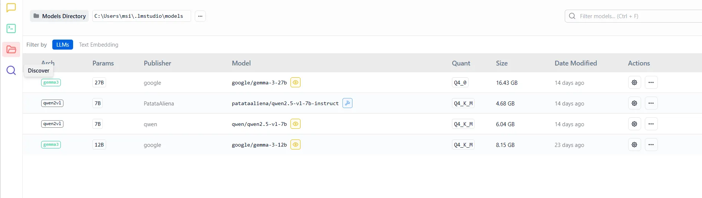

# UWA Library Metadata Generation App

A step-by-step walkthrough to installing and running the UWA Library Metadata Generation App. Before you run the application, it is crucial to follow the prerequisite steps.

---

# Prerequisites
[LLM Studio](https://lmstudio.ai/download) 
---
Download the LLM studio launcher that is compatible with your operating system. Run the launcher as you would a normal installer.



- **Operating System:** [e.g., Windows 10+, macOS 12+, Ubuntu 20.04+]
- **Python:** [e.g., Version 3.9 or above]
- **Node.js:** [e.g., Version 18 or above] <!-- Remove if not applicable -->
- **Package Manager:** [e.g., pip, npm, yarn, uv]
- **Other Dependencies:** [e.g., Git, Docker, Redis]

---

##  Quick Installation

### Method 1: Using Package Manager (Recommended for most users)

<details>
<summary>Qwen </summary>

<details>
<summary>Gemma27 </summary>


```bash
# Using pip
pip install [package-name]

# Using npm
npm install [package-name]

# Using yarn
yarn add [package-name]

# Using uv

uv pip install [package-name]


